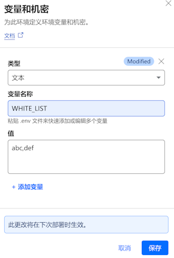

# docker-registry
使用 cloudflare pages 来加速访问 dockerhub 镜像。

## 0.风险警告

Cloudflare 在 2024 年 12 月 3 日更新使用协议，此次更新 Cloudflare 明确说明不得将其服务作为代理使用，否则将被视为违反服务条款的行为可能会被封号。具体参见 Cloudflare Terms 第 2 项服务、第 2.2 项使用服务、第 2.2.1 项限制中。具体参见 [Cloudflare更新服务条款明确说明不得将其作为代理使用 也不得优选IP](https://www.landiannews.com/archives/107113.html)。

本项目仅供学习和测试使用使用，请于 24 小时后取消 cloudflare 的部署。


## 1.快速部署
请将本项目仓库 fork 到自己的 github 仓库，然后在 cloudflare pages 中新建项目来使用。
1.使用 cloudflare 账号登录其 dashboard 后台，选择 **Workers 和 Pages** 菜单，然后点击 **概述**，接着点击 **创建** 按钮，在打开的页面中选择 Pages 选项卡：


**图1.1**

选择 git 模式进行部署。

2.选择你 clone 好的项目，点击 **开始设置** 按钮：


**图1.2**

3.除了项目名字和输出目录 **public** 之外，所有配置项都使用默认值即可，点击 **保存并部署** 按钮：


**图1.3**

4.经过短暂时间的等待，如果你看到如下界面，恭喜你部署成功：


**图1.4**

5.点击 **继续处理项目按钮**，在展示的页面中点击 **访问站点** 链接，即可验证站点的部署情况，不过默认需要等几分钟才能打开网站。


**图1.5**

6.网站可访问后展示效果：


**图1.6**

更多详细使用教程参见 [cloudflare page 教程（一）项目初始化](https://blog.whyun.com/posts/project-init-on-cloudflare-pages/) 。

## 2.配置
### 2.1 镜像源配置
#### 2.1.1 docker
修改 `/etc//docker/daemon.json`，在 registry-mirrors 属性数组中添加刚才部署的网站。
```json
{
  "registry-mirrors": [
    "https://docker-registry-xxx.pages.dev"
  ]
}
```
**代码 2.1.1.1**

然后运行 `sudo systemctl restart docker` 后即可生效。
#### 2.1.2 podman
修改 `/etc/containers/registries.conf`，找到 [[registry]] 配置项，并修改以下属性：

```ini
[[registry]]
prefix = "docker.io"
insecure = false
blocked = false
location = "docker-registry-xxx.pages.dev"
```
**代码 2.1.2.1**

### 2.2 权限配置

如果不做任何配置，通过 **代码 2.1.1.1** 配置后，docker 命令可以正常使用。但是这个样子相当于将网站直接公开，任何都可以调用，有风险会将 Cloudflare 的免费资源耗尽。为此本项目增加了权限管控功能。

通过配置环境变量 `WHITE_LIST` 来控制允许的用户列表，多个用户之间用英文逗号分隔。`WHITE_LIST` 生效后，在拉取任何镜像时，你需要确保 `docker login` (或者 `podman login`) 命令之前已经调用成功，否则后端读取不到登录用户，会直接报错，不会再拉取镜像。比如你的镜像站域名是 `docker-registry-xxx.pages.dev` ，那么需要保证调用 `docker login docker-registry-xxx.pages.dev` 是成功的。

> 可以通过 cloudflare dashboard 的面板进行环境变量设置。  
>   
> **图 2.2.1**

注意配置了此环境变量时，虽然增加了安全性，也同时会牺牲 docker 命令的便利性。配置此变量，意味着你不能通过 `docker pull alpine` 来拉取镜像，你必须使用 `docker pull docker-registry-xxx.pages.dev/library/alpine` 来拉取镜像。

如果想实现写短名字拉取镜像的方式，可以尝试使用 podman。

## 已知问题
### 关于部署后域名无法访问问题
cloudflare pages 解析出来的域名可能在某些运营商上无法访问，这时可以借助优选 IP 项目 [CloudflareSpeedTest](https://github.com/XIU2/CloudflareSpeedTest) ，找到一个本地访问最好的 IP ，配置到本地 hosts 中。注意优选 IP 依然是有违 cloudflare 条款的。

